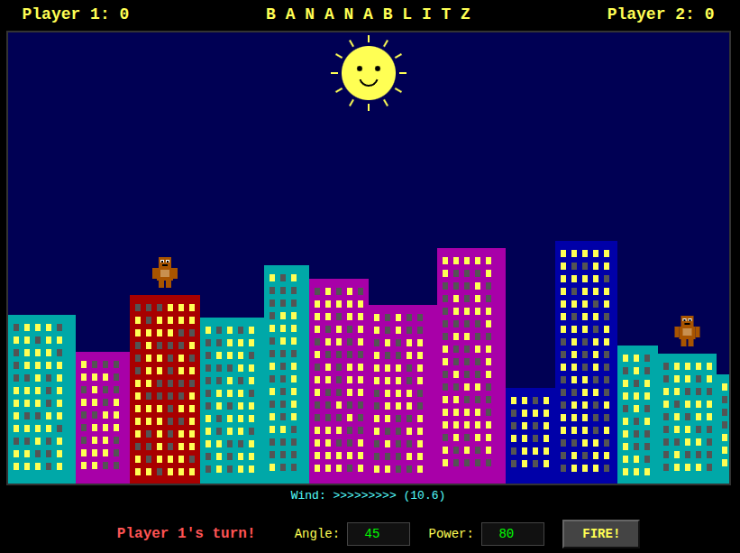

<div align="center">

```
  ██████   █████  ███    ██  █████  ███    ██  █████
  ██   ██ ██   ██ ████   ██ ██   ██ ████   ██ ██   ██
  ██████  ███████ ██ ██  ██ ███████ ██ ██  ██ ███████
  ██   ██ ██   ██ ██  ██ ██ ██   ██ ██  ██ ██ ██   ██
  ██████  ██   ██ ██   ████ ██   ██ ██   ████ ██   ██

  ██████  ██      ██ ████████ ███████
  ██   ██ ██      ██    ██       ███
  ██████  ██      ██    ██      ███
  ██   ██ ██      ██    ██     ███
  ██████  ███████ ██    ██    ███████
```

### *Two apes. One city. Exploding bananas.*

[](#quick-start)
[](https://developer.mozilla.org/en-US/docs/Web/API/Canvas_API)
[](https://developer.mozilla.org/en-US/docs/Web/JavaScript)
[](LICENSE)
[]()

<br>

```
                          *  .  *
                       .  *  .  *  .
                  *  .  BOOM!  .  *
                       .  *  .  *  .
                          *  .  *

     __               ___                         ___               __
    |  |  ~~>  🍌    |   |                       |   |    🍌  <~~  |  |
    |__|             _|   |_   ___           ___  |   |_            |__|
   /    \           |       | |   |   ___   |   | |     |          /    \
  |  @@  |          |       | |   |  |   |  |   | |     |        |  @@  |
  | \__/ |     _____|       |_|   |__|   |__|   |_|     |_____   | \__/ |
  |______|    |________________________________________________|  |______|
```

</div>

---

## About

A browser-based artillery game inspired by the classic **GORILLAS.BAS** that shipped with MS-DOS 5.0 in 1991. Two apes stand atop a randomly generated city skyline, hurling explosive bananas at each other.

**Built from scratch as a single HTML file.** No build tools. No frameworks. No dependencies. Just open it in your browser and play.

> This is an original, clean-room implementation. No code from the original Microsoft game was used.

## Screenshots

<div align="center">



*Ready to fire — two apes on a randomly generated skyline*


*Banana in the air! Watch the trajectory...*


*Direct hit — buildings crumble under the explosive banana impact*

</div>

## Features

| Feature | Description |
|---------|-------------|
| **Destructible Terrain** | Pixel-based buildings with real circular craters that carve into the skyline |
| **Physics Simulation** | Realistic projectile trajectory with gravity and wind effects |
| **The Sun** | It watches. It reacts. Throw a banana at it and find out. |
| **Retro Palette** | Authentic QBasic-era color scheme |
| **Per-Player Memory** | Each player's angle and power settings persist between turns |
| **Explosion FX** | Animated particle explosions on impact |
| **Ape Animations** | Throwing arm animations on each toss |
| **Zero Dependencies** | Single HTML file, works offline, nothing to install |

## How to Play

```
1. Player 1 sets Angle (0-180°) and Power (1-500)
2. Press FIRE! (or hit Enter)
3. Watch the banana arc across the sky
4. Player 2 adjusts their own angle and power
5. Repeat until someone gets hit!
```

> **Pro tip:** Watch the wind indicator — it can make or break your shot.

## Quick Start

**Option A — Just open it:**
```bash
git clone https://github.com/YOUR_USERNAME/banana-blitz.git
cd banana-blitz

open index.html          # macOS
xdg-open index.html      # Linux
start index.html         # Windows
```

**Option B — With a local server:**
```bash
python3 -m http.server 8000
# or
npx serve .
```

Then visit `http://localhost:8000`

## Controls

| Input | Action |
|-------|--------|
| `Angle` | Launch angle in degrees (0° = horizontal, 90° = straight up) |
| `Power` | Launch velocity — higher = further |
| `FIRE!` / `Enter` | Launch the banana |

## How It Works

The game uses an **offscreen canvas** as a pixel-based terrain system:

- Buildings are rendered once to an offscreen `<canvas>` element
- **Collision detection** reads individual pixels via `getImageData()` — any non-transparent pixel is terrain
- **Crater carving** uses `globalCompositeOperation: 'destination-out'` to punch circular holes
- Craters stack, overlap, and create complex destruction patterns

```
Before:                     After:
██████████████████          ██████████████████
██████████████████          █████      ███████
██████████████████    💥    █████        █████
██████████████████   ───>   ██████      ██████
██████████████████          ██████████████████
██████████████████          ██████████████████
```

## Tech Stack

- **HTML5 Canvas** — all rendering
- **Vanilla JavaScript** — game logic and physics
- **CSS** — UI controls
- That's it. No React. No Webpack. No `npm install`. Just vibes.

## Browser Support

| Browser | Supported |
|---------|-----------|
| Chrome / Edge | Yes |
| Firefox | Yes |
| Safari | Yes |

## Contributing

PRs welcome! The entire game is one file — `index.html`.

## Acknowledgments

Inspired by **GORILLAS.BAS** (1991) by Microsoft, originally bundled with MS-DOS 5.0 and QBasic. Written by Richard Moe, Lance Delarme, and Lyle Hazle.

## License

[The Unlicense](LICENSE) — public domain. Do whatever you want with it.

---

<div align="center">

*No apes were harmed in the making of this game.*

```
  __
 |  |
 |__|    ~~ 🍌
/    \
| @@ |   "Your turn."
| \/ |
|____|
```

</div>
